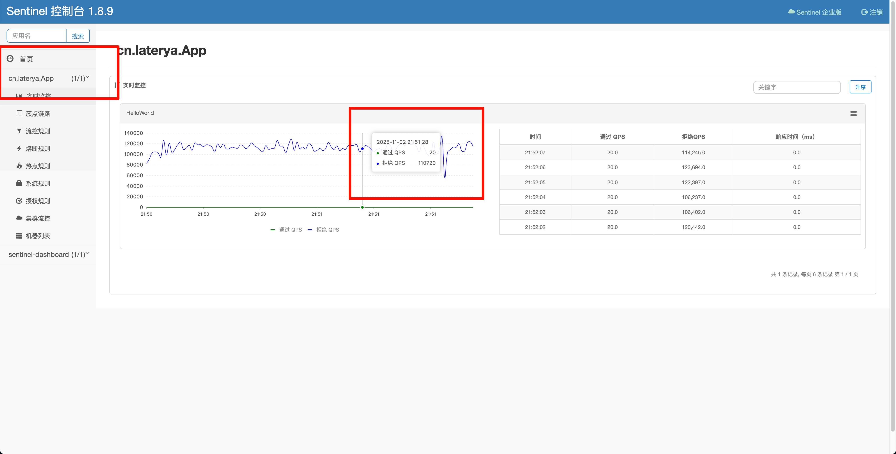

# sentinel-demo

## 快速开始

参考官方文档：https://sentinelguard.io/zh-cn/docs/quick-start.html

### 启动控制台

src/main/resources目录下的 sentinel-dashboard-1.8.9.jar，使用指令启动

```shell
 java -Dserver.port=8080 -Dcsp.sentinel.dashboard.server=localhost:8080 -Dproject.name=sentinel-dashboard -jar sentinel-dashboard-1.8.9.jar
```

启动成功后，访问 http://localhost:8080
账号密码都是 sentinel

### 启动服务

```java
public class App {
    public static void main(String[] args) {
        // 配置规则.
        initFlowRules();

        while (true) {
            // 1.5.0 版本开始可以直接利用 try-with-resources 特性
            try (Entry entry = SphU.entry("HelloWorld")) {
                // 被保护的逻辑
                System.out.println("hello world");
            } catch (BlockException ex) {
                // 处理被流控的逻辑
                System.out.println("blocked!");
            }
        }
    }

    private static void initFlowRules() {
        List<FlowRule> rules = new ArrayList<>();
        FlowRule rule = new FlowRule();
        rule.setResource("HelloWorld");
        rule.setGrade(RuleConstant.FLOW_GRADE_QPS);
        // Set limit QPS to 20.
        rule.setCount(20);
        rules.add(rule);
        FlowRuleManager.loadRules(rules);
    }
}

```

编辑JVM参数，添加`-Dcsp.sentinel.dashboard.server=127.0.0.1:8080`，连接到控制台。
查看控制台：


## sentinel 基本原理

参考官方文档：https://sentinelguard.io/zh-cn/docs/basic-implementation.html

在 Sentinel 里面，**所有的资源都对应一个资源名称以及一个 Entry**。Entry 可以通过对主流框架的适配自动创建，也可以通过注解的方式或调用
API 显式创建；每一个 Entry 创建的时候，同时也会创建一系列功能插槽（slot chain）。这些插槽有不同的职责，例如:

- NodeSelectorSlot 负责收集资源的路径，并将这些资源的调用路径，以树状结构存储起来，用于根据调用路径来限流降级；
- ClusterBuilderSlot 则用于存储资源的统计信息以及调用者信息，例如该资源的 RT, QPS, thread count 等等，这些信息将用作为多维度限流，降级的依据；
- StatisticSlot 则用于记录、统计不同纬度的 runtime 指标监控信息；
- FlowSlot 则用于根据预设的限流规则以及前面 slot 统计的状态，来进行流量控制；
- AuthoritySlot 则根据配置的黑白名单和调用来源信息，来做黑白名单控制；
- DegradeSlot 则通过统计信息以及预设的规则，来做熔断降级；
- SystemSlot 则通过系统的状态，例如 load1 等，来控制总的入口流量；


## 与 Dubbo 集成

参考 demo 项目：https://github.com/alibaba/Sentinel/tree/master/sentinel-demo/sentinel-demo-dubbo
官方文档：https://sentinelguard.io/zh-cn/docs/open-source-framework-integrations.html

Sentinel 提供了与 Dubbo 整合的模块 `Sentinel Dubbo Adapter`，主要包括针对 Service Provider 和 Service Consumer 实现的
Filter。使用时用户只需引入以下模块：

```xml

<dependency>
    <groupId>com.alibaba.csp</groupId>
    <artifactId>sentinel-apache-dubbo-adapter</artifactId>
    <version>1.8.0</version>
</dependency>
```

引入此依赖后，Dubbo 的服务接口和方法（包括调用端和服务端）就会成为 Sentinel 中的资源，在配置了规则后就可以自动享受到
Sentinel 的防护能力。

若不希望开启 Sentinel Dubbo Adapter 中的某个 Filter，可以手动关闭对应的 Filter，比如：

```java

@Bean
public ConsumerConfig consumerConfig() {
    ConsumerConfig consumerConfig = new ConsumerConfig();
    consumerConfig.setFilter("-sentinel.dubbo.consumer.filter");
    return consumerConfig;
}
```